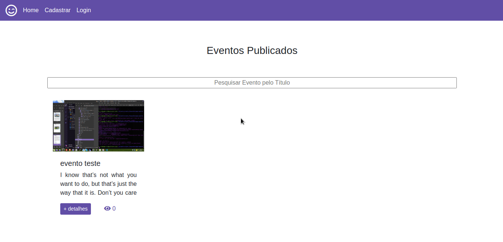
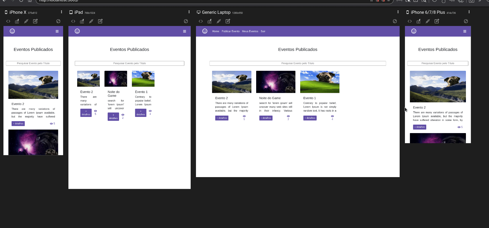

 # 🎟️ Manage and create your event

Project created with react, redux, firebase (auth, send recovery password, firestore and storage file). To manage some events

Link: https://eventos2-6dc6f.web.app/

  
 
  
 

 

  

Responsible project by Responsively

  

 

##  ⚙️ Configure project:

In the config dir, firebase.js archive, you need set informations about your database firebase.

 

 

<h4 align="center">
  ---

Made with ♥   by Arthur Lima :wave: [Get in touch!](https://www.linkedin.com/in/arthur-lima-294ab0103/)
</h4>

